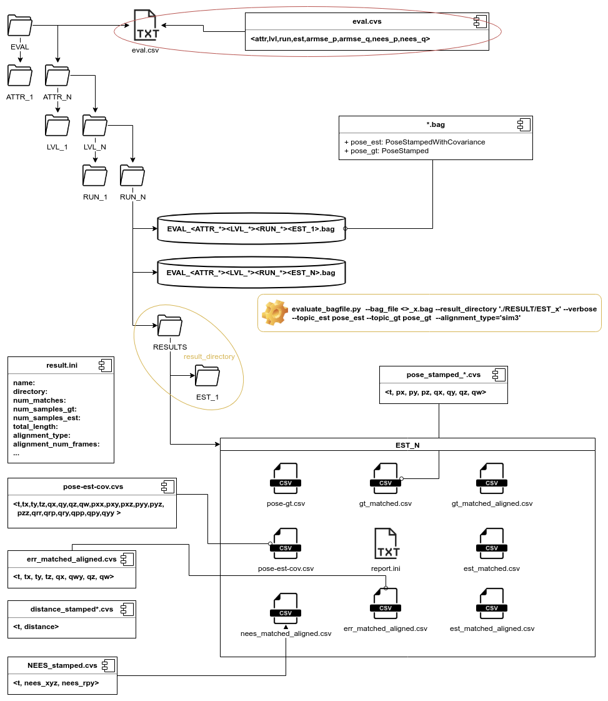

# Estimator Evaluation

The [EstimatorEvaluation](EstimatorEvaluation.py) expects the `eval_dir` to have a [certain structure](#folder-structure) and containing recorded rosbag files with a strict [naming convention](#rosbag-file-name-convention).
These bag files must contain two topics:
1. `pose_est` of the type [geometry_msgs::PoseStampedWithCovariance](http://docs.ros.org/en/jade/api/geometry_msgs/html/msg/PoseWithCovarianceStamped.html)
2. `pose_gt` of the type [geometry_msgs::PoseStamped](http://docs.ros.org/en/jade/api/geometry_msgs/html/msg/PoseStamped.html)

HINT: technically the topic `pose_gt` can a [geometry_msgs::TransformStamped](http://docs.ros.org/en/jade/api/geometry_msgs/html/msg/TransformStamped.html), but was not tested (the conversio is done by the package [rosbag2csv]()). The stamps of the topics need to stem from a time synchronized sources. Furthermore the timestamp of the estimate needs to relate to the corresponding timestamp of the ground-truth value, as no time alignment is performed!. Messages can be provided at different rates, i.e. `pose_gt` at 360 Hz (motion capture system) and `pose_est` at an average of ~20-30 Hz. The  [TrajectoryEvaluation](.../trajectory_evaluation/TrajectoryEvaluation.py) will take care about the time association and spatial alignment of the trajectories.

This means if you want to run a simple test using only one rosbag file, you have to follow that structure and naming convention for the rosbag file strictly!  

The [EstimatorEvaluation](EstimatorEvaluation.py) will create in the folder containing the rosbag files a folder `RESULTS`.
The resulting folder holds a subfolder for each estimator (specified by the field `EST_<*>` in the rosbag file name).
An example: a rosbag file in `EVAL/ATTR_2/LVL_3/RUN_20/EVAL_ATTR_2_LVL_3_RUN_20_EST_99.bag`, will result in a result directory `EVAL/ATTR_2/LVL_3/RUN_20/RESULTS/EST_99/`. The [EstimatorEvaluation](EstimatorEvaluation.py) will run a [TrajectoryEvaluation](.../trajectory_evaluation/TrajectoryEvaluation.py) that performs the conversion, matching, alignment, error + NEES computation, unless there already exists a `report.ini` in that directory. This means that this report is a "checkpoint", and rerunning the evaluation will not repeat the costly conversions and calculations. Technically one can abort the evaluation at any point (hitting `CTRL+C/D`) and repeat it later on.

After the estimator evaluation is done, an evaluation report `EVAL/eval.csv` is created from the [EstimatorReport](EstimatorReport.py)  containing a summary of all these [TrajectoryEvaluation](.../trajectory_evaluation/TrajectoryEvaluation.py)s.
  Another tool [EvaluationAnalyzer](EvaluationAnalyzer.py) can be uses load the report, to calculate statistics and to create plots.


## folder structure

The evaluation expects a certain folder structure for the `eval_dir`:
```commandline
# folder structure:
# - EVAL
#   - ATTR_1
#   - ATTR_*
#   - ATTR_N
#     - LVL_1
#     - LVL_*
#     - LVL_M
#       - RUN_1
#       - RUN_*
#       - RUN_K
#           - EVAL_<ATTR_N>_<LVL_M>_<RUN_K>_<EST_1>.bag
#           - EVAL_<ATTR_*>_<LVL_*>_<RUN_*>_<EST_*>.bag
#           - RESULTS  (will be created by EstimatorEvaluation)
#               - EST_1
#               - EST_*
#                   - report.ini
#                   - *.csv
# - eval.csv (will be created by EstimatorEvaluation)
```



## Dependencies

* [rosbag2csv]()
* [script_utils]()
* [ros_csv_formats]()
* [trajectory_evaluation]()

## run

### EstimatorEvaluation
```commandline
estimator_evaluation$ python3 EstimatorEvaluation.py -h
usage: EstimatorEvaluation.py [-h] --eval_dir EVAL_DIR [--redo] [--plot]
                              [--save_plot] [--alignment_type ALIGNMENT_TYPE]
                              --thresholds THRESHOLDS [THRESHOLDS ...]
                              [--frames FRAMES]

EstimatorEvaluation: crawling through a folder structure and evaluating estimators:
- EVAL/
	 - ATTR_*/
		 - LVL_*/
			 - RUN_*/
				 - EVAL_<ATTR_*>_<LVL_*>_<RUN_*>_<EST_*>.bag
				 - RESULTS/  (will be created by EstimatorEvaluation)
					 - EST_*/
						 - report.ini (check point)  
						 - *.csv  
						 - *.png
 - eval.csv (final result)
 - eval_analyzed.csv (final result)

optional arguments:
  -h, --help            show this help message and exit
  --eval_dir EVAL_DIR   root directory of evaluation
  --redo
  --plot                shows the different plots of TrajectoryEvalution()
  --save_plot           store the different plots of TrajectoryEvalution()
  --alignment_type ALIGNMENT_TYPE
                        alignment types are: None, se3, sim3, posyaw, pos
  --thresholds THRESHOLDS [THRESHOLDS ...]
                        position and orientation armse thresholds (<float> [m] <float> [deg])
                        for estimators judgeing
  --frames FRAMES       # of frames for trajectory alignment, -1 = all
```

---
## License
This software is made available to the public to use (_source-available_),
licensed under the terms of the BSD-2-Clause-License with no commercial use allowed, the full terms of which are made available in the LICENSE file. No license in patents is granted.

### Usage for academic purposes
If you use this software in an academic research setting, please cite the
corresponding paper and consult the `LICENSE` file for a detailed explanation.

```latex
@inproceedings{vinseval,
   author   = {Alessandro Fornasier and Martin Scheiber and Alexander Hardt-Stremayr and Roland Jung and Stephan Weiss},
   journal  = {2021 Proceedings of the IEEE International Conference on Robotics and Automation (ICRA21 - accepted)},
   title    = {VINSEval: Evaluation Framework for Unified Testing of Consistency and Robustness of Visual-Inertial Navigation System Algorithms},
   year     = {2021},
}
```
